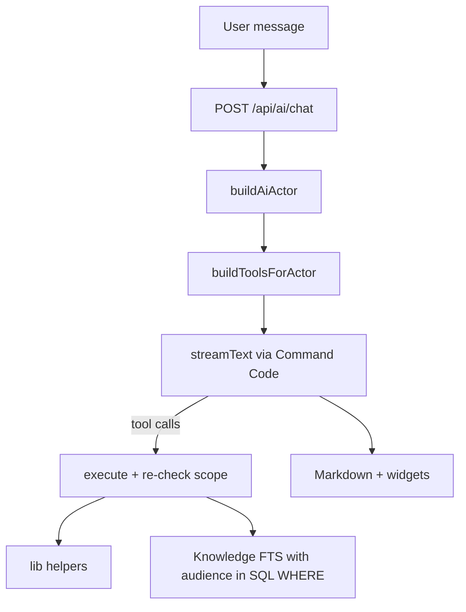

# mediend AI

Role-scoped assistant at `/training`. Answers come from existing internal APIs exposed as LLM tools, plus an audience-controlled knowledge base (Postgres full-text search). Access control is enforced by **only registering the tools** the current user is entitled to.

## Setup

Choose **one** provider.

### Option A — DeepSeek direct (sk-… key from platform.deepseek.com)

```bash
AI_GATEWAY_BASE_URL=https://api.deepseek.com
AI_GATEWAY_API_KEY=sk_your_deepseek_api_key
AI_CHAT_MODEL=deepseek-v4-flash
```

### Option B — Command Code gateway (user_… key from Command Code Studio)

```bash
AI_GATEWAY_BASE_URL=https://api.commandcode.ai/provider/v1
AI_GATEWAY_API_KEY=user_your_command_code_api_key
# Or: COMMAND_CODE_API_KEY=user_…
AI_CHAT_MODEL=deepseek/deepseek-v4-flash
```

Generate Command Code keys in [Command Code Studio](https://commandcode.ai/docs/studio/api-keys) (Provider plan or higher).  
Generate DeepSeek keys at [platform.deepseek.com](https://platform.deepseek.com/api_keys).

**Do not** use a DeepSeek `sk-…` key with the Command Code URL — you will get `Invalid Authorization header or token`.

Optional model IDs (see `opencode.json`): `deepseek/deepseek-v4-pro`, `Qwen/Qwen3.6-Plus`, `Qwen/Qwen3.7-Max`.

The gateway is wired via `@ai-sdk/openai` (`lib/ai/provider.ts`), not `@ai-sdk/openai-compatible` — the compatible package v3.x returns model spec v4, which `ai@6` rejects.

Apply the knowledge/audit migration (includes `tsvector` + GIN index):

```bash
bunx prisma migrate deploy
# or: bunx prisma db push
```

## Architecture

| Piece | Path |
|-------|------|
| Chat UI | `app/training/page.tsx` |
| Knowledge admin | `app/training/documents/page.tsx` (SUPER_ADMIN, EXECUTIVE_ASSISTANT) |
| Chat API | `POST /api/ai/chat` |
| Capabilities | `GET /api/ai/capabilities` |
| Knowledge API | `GET/POST /api/ai/knowledge`, `PATCH/DELETE /api/ai/knowledge/[id]` |
| Provider | `lib/ai/provider.ts` (Command Code OpenAI-compatible gateway) |
| Actor / scope | `lib/ai/actor.ts` |
| Tool registry | `lib/ai/registry.ts` |
| Tools | `lib/ai/tools/{self,team,global,knowledge}.ts` |
| Knowledge FTS | `lib/ai/knowledge.ts` |
| Subject resolve | `lib/ai/resolve-subject.ts` |



## Security model

1. **Registration-time filter** — disallowed tools are omitted from the model’s tool set.
2. **Execution-time re-check** — every tool execute re-asserts permission and clamps data scope.
3. **No raw SQL** — the old `executeQuery` / `/api/ai/sql` surface was removed.
4. **Subjects by name only** — team tools resolve people via `resolveSubject`; raw employee IDs from the model are never accepted. Out-of-hierarchy names return `OUT_OF_SCOPE`.

### Tool scopes

| Scope | Who gets them |
|-------|----------------|
| SELF | Any authenticated employee (own targets, leaves, attendance, leads, KB search) |
| TEAM | Managers with subordinates / `hierarchy:team:read` / subtree sales roles |
| GLOBAL | MD, ADMIN, SUPER_ADMIN, SALES_HEAD, EXECUTIVE_ASSISTANT (+ HR_HEAD for org HR KPIs) |

## Knowledge base

- Documents: general or restricted (roles + users + departments).
- Search uses `websearch_to_tsquery` + `ts_rank`; audience predicates live **inside** the SQL `WHERE` (not post-filtered in JS).
- SUPER_ADMIN and MD bypass audience filters.

## UI

- Streaming via `useChat` + `DefaultChatTransport`
- Markdown (`react-markdown` + `remark-gfm`)
- Widgets for targets, leave, attendance pie, IPD leaderboard bars, KB citations
- Role-aware suggested prompts from `/api/ai/capabilities`

## Audit

`AiConversation`, `AiMessage`, `AiToolCall` log tool names, inputs, and `denied` when a call returns `OUT_OF_SCOPE`.

## RBAC smoke test

```bash
bun scripts/test-ai-rbac.ts
```

Snapshots tool names per role and asserts peer name lookups return `OUT_OF_SCOPE` for a BD.
